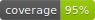

[](https://)[](https://github.com/Ori-Roza/drf-api-action/actions/workflows/tests.yaml)

[](https://)


The `drf-api-action` library is an extension to the `rest_framework` package that provides an additional decorator called `api_action` based on the existing `action` one.
This decorator transforms a REST API call in a class view into a function call. It allows you to create an instance of the view and call its functions explicitly.

The benefits of using DRF inside your API functions:

* Arguments validation
* Pagination
* Clear separation between function signature and business logic
* Makes Django DB models accessible in other libraries/web services
* transform the app to a web server in a click

And many more!

## Installation

You can install `drf-api-action` using pip:

```shell
pip install drf-api-action
```

## Usage

To use `drf-api-action`, you need to follow these steps:

### Step 1: Import the Required Classes and Decorators

Import the necessary classes and decorators from `drf-api-action` and `rest_framework`:

```python
from drf_api_action.decorators import action_api
from drf_api_action.mixins import APIRestMixin
from rest_framework.viewsets import ModelViewSet
```

### Step 2: Define Your View Class

Create your view class by inheriting from `APIRestMixin` and `ModelViewSet`:

```python
class DummyView(APIRestMixin, ModelViewSet):
    queryset = DummyModel.objects.all()
    serializer_class = DummySerializer
```

### Step 3: Define Your API Actions

Use the `action_api` decorator to define your API actions as functions inside your view class:

```python
    @action_api(detail=True, methods=["get"], serializer_class=DummySerializer)
    def dummy_func(self, request, **kwargs):
        serializer = self.get_serializer(instance=self.get_object())
        return Response(data=serializer.data, status=status.HTTP_200_OK)
```

In the example above, the `dummy_func` function is decorated with `action_api`. It specifies that the action does not require a detail argument, supports the `POST` method, and uses the `DummySerializer` for serialization.

### Step 4: Create an Instance and Call API Actions

Create an instance of your view class and call the API actions as regular functions:

```python
api = DummyView()
results = api.dummy_func(**args)
```
example:


In the example above, we create an instance of `DummyView` and call the `dummy_func` action with the specified arguments (`args`) and an additional `page` argument.


### Step 5: Run as a server
```bash
python3 drf-api-action/tests/manage.py
```


## Pagination Support

The `drf-api-action` library provides support for pagination in conjunction with `rest_framework` pagination classes. To enable pagination, include a `page` argument in your API action function and use it when paginating the queryset.

```python
@action_api(detail=False, methods=["get"], serializer_class=DummySerializer)
def dummy_func(self, request, **kwargs):
    queryset = DummyModel.objects.filter(dummy_int=request.data["dummy_int"]).order_by("id")
    page = self.paginate_queryset(queryset)
    serializer = self.get_serializer(page, many=True)
    return self.get_paginated_response(serializer.data)
```

In the example above, the `dummy_func` API action supports the `GET` method and includes a `page` argument. The `paginate_queryset` method is used to paginate the `queryset`, and the paginated data is serialized and returned.

To use pagination, pass the `page` argument when calling the API action:

```python
results = view.dummy_func(**args, page=1)
```

## Testing

The `drf-api-action` library includes tests to ensure the functionality works as expected. To run the tests, follow these steps:

1. Navigate to the root directory of the `drf-api-action/` project.
```bash
cd tests/
```

2. Run the tests using `pytest`

 ```shell
 python -m pytest -vv
 ```

The tests will be executed, and the results will be displayed in the console.

## Contribution

Contributions to the `drf-api-action` library are welcome. If you would like to contribute, please follow these steps:

1. Fork the `drf-api-action` repository on GitHub.

2. Create a new branch for your feature or bug fix.

3. Make the necessary changes and additions.

4. Write tests to cover the new functionality or bug fix.

5. Run the existing tests to ensure all tests pass successfully.

6. Commit your changes and push them to your forked repository.

7. Open a pull request on the original `drf-api-action` repository and provide a detailed description of your changes.

The maintainers will review your pull request, provide feedback, and work with you to merge the changes into the main repository.

Thank you for considering contributing to `drf-api-action`!
